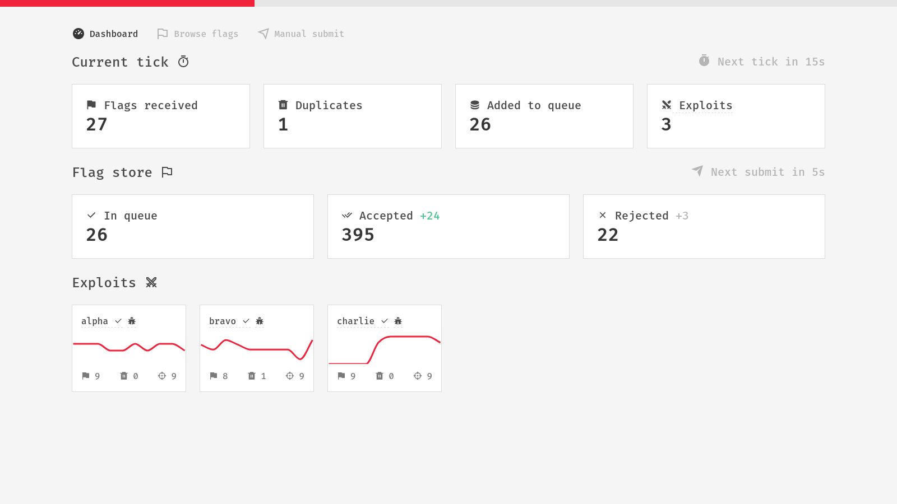
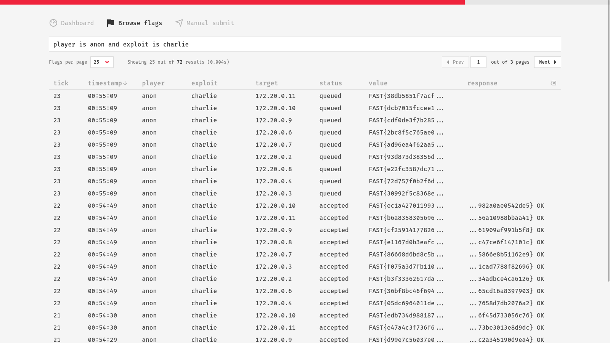

# 🚩 Fast — Flag Acquisition and Submission Tool

Fast is a specialized tool built in Python designed for managing exploits and automating flag submission in Attack/Defense (A/D) competitions. The goal of Fast is to take the technical burden off the team players, allowing them to focus on writing exploits and patching vulnerabilities.

The development of Fast was heavily influenced by the practical experiences and valuable insights gathered by the **Serbian National ECSC Team** 🇷🇸 who utilized the tool in multiple A/D competitions. Fast's development roadmap will continue to be aligned with the team's needs.

## Installation

To install the latest release, run the following command:

```sh
pip install https://github.com/dusanlazic/fast/releases/download/v1.0.0/fast-1.0.0.tar.gz
```

## Overview

### Manage Exploits with YAML

```yaml
connect:
  host: 192.168.13.37
  port: 2023
  player: s4ndu

exploits:
  - name: alpha
    targets:
      - 10.1.2-11.1
  
  - name: bravo
    targets:
      - 10.1.2.1
      - 10.1.6.1
      - 10.1.8-11.1
  
  - name: charlie
    run: ./charlie.sh [ip]
    targets:
      - 10.1.2-11.1
```

### Utilize Tick Time Wisely

```yaml
- name: lima
  batches:
    count: 5
    wait: 3
  targets:
    - 10.1.2-31.1

- name: mike
  delay: 2
  batches:
    size: 8
    wait: 3
  targets:
    - 10.1.2-31.1
```


### Straightforward Exploit and Submitter Templates


```python
from typing import List

def exploit(target: str) -> List[str]:
    flags = []

    # Exploit the target, get the flags

    return flags
```

```python
from typing import List, Tuple, Dict

def submit(flags: List[str]) -> Tuple[Dict[str, str], Dict[str, str]]:
    accepted_flags = {}
    rejected_flags = {}

    # Submit and categorize flags

    return accepted_flags, rejected_flags

```

### See the Flags Yourself With Dashboard






### Pressure-Friendly Query Language

Here are the examples of some actual queries. Basically, anything you write will likely work.

```
player is alice
target = 10.1.3.5
tick >= 25
timestamp after 15:30
status is accepted
response matches ".* OK"
value starts with "FAST{"
status in [accepted, rejected]
exploit not in [alpha, bravo]
timestamp between 14:00 and 16:00
response ending with "OK"
player is bob and status is rejected
exploit is alpha or target = "10.1.4.1"
status == accepted && (exploit == beta || target == 10.1.5.1)
player is charlie and timestamp < 12:00
value contains "FAST" and status is not rejected
target starts with "10.1."
response != "DEMOffoxfzhX0avVWS/wBb0oMljtFde6Ir/10GUmv3aXFIcUXbM= OLD"
tick between [10, 20]
player is not alice and status in [accepted, queued]
exploit is delta and (timestamp > 10:00 && timestamp < 14:00)
response matches ".* DUP"
player of [eve, frank]
target ends with ".5"
exploit is gamma and status is not queued
exploit is alpha or (target is 10.1.4.1 and (timestamp < 16:00 or timestamp > 18:00))
```

### Read the Docs for more

[Fast docs](https://lazicdusan.com/fast)
