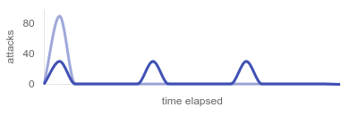

This page dives into the details of exploit management within Fast. Serving both as a comprehensive reference and a practical guide, this page illustrates the capabilities of Fast through examples, and explains how and when to utilize them.

## Overview

### Introduction

All exploit management takes place in the `exploits` section of `fast.yaml`.

```yaml
connect:
  host: 192.168.13.37
  port: 2023
  player: yourname

exploits:
  - name: alpha
    targets:
      - 10.1.2-11.1

  - name: bravo
    targets:
      - 10.1.2-11.1
```

This file is designed to be continuously updated throughout the game. Any modifications made to the `exploits` section are automatically applied at the beginning of the next tick, ensuring a seamless integration with ongoing game activities.

If you accidentally write an invalid configuration (bad formatting, accidental save, etc.), Fast will reuse the last working configuration until you fix it. The error messages related to your configuration will be logged to the console.

### How It Works

The only two fields required to start running a Python exploit are `name` and `targets`. 

Fast *runner* will look for the module in the current working directory with the same name (module name, not filename) and import it dynamically. A "runner" is a child process responsible for running a single exploit, ensuring that each exploit gets its own separate interpreter and it bypasses the main process's Global Interpreter Lock (GIL).

Since exploits are typically I/O bound tasks, runners utilize threading to run the exploit on multiple targets at once. To sum up, each exploit gets its own process/interpreter, and each target get its own thread within that process.

For non-Python exploits it's a bit different since a non-Python script cannot be imported into Python. Instead of a thread, Fast runner will start a subprocess for each target, running shell commands provided in the `run` field.

### Basic Minimal Example

=== "Python"

    ```yaml
    - name: alpha
      targets:
        - 10.1.2-11.1
    ```

=== "Non-Python"

    ```yaml
    - name: alpha
      run: bash alpha.sh [ip] 
      targets:
        - 10.1.2-11.1
    ```

## Usage

### Specifying Targets

IP addresses can be listed individually, and IP ranges can be expressed using hyphens.

```yaml
- name: alpha
  targets:
    - 10.1.3.1
    - 10.1.5.1
    - 10.1.7-10.1
```

!!! example "About the Example"
    At the beginning of each tick Fast will concurrently run the exploit *alpha* on the following targets:

    - 10.1.**3**.1, 10.1.**5**.1, 10.1.**7**.1, 10.1.**8**.1, 10.1.**9**.1, 10.1.**10**.1.

### Customizing Exploit Name

You can set a custom exploit name that will be shown in the logs and on the web dashboard. Simply change the value of the `name` field, and set the `module` field to the actual name of your Python module.

```yaml
- name: bravo v2
  module: bravo
  targets:
    - 10.1.2-11.1

- name: charlie
  module: charlie3_Final_fixed
  targets:
    - 10.1.2-11.1
```

This field is mandatory when running a non-Python exploit.

```yaml
- name: delta
  run: bash delta [ip]
  targets:
    - 10.1.2-11.1
```

### Running a Non-Python Exploit

To run a non-Python exploit, set the `run` field to a shell command used for running the exploit. Ensure that the target's IP address can be passed as a command-line argument to your exploit. In your provided command, use `[ip]` as a placeholder for the actual IP address.

```yaml
- name: delta
  run: bash delta.sh [ip]
  targets:
    - 10.1.2-5.1
```

!!! example "About the example"

    At the beginning of each tick Fast will run the following commands in parallel:
    ```
    bash delta.sh 10.1.2.1
    bash delta.sh 10.1.3.1
    bash delta.sh 10.1.4.1
    bash delta.sh 10.1.5.1
    ```

Exploits written in other languages are handled the same way:

```yaml
node exploit.js [ip]
bash exploit.sh [ip]
java -jar exploit.jar [ip]
dotnet exploit.dll [ip]
ruby exploit.rb [ip]
perl exploit.pl [ip]
php exploit.php [ip]
./rust_exploit [ip]
./exploit.sh [ip]
```

If you are running an executable file directly (e.g., `./exploit.sh [ip]`), ensure that you have set the execute permission, and you have added an appropriate shebang line (`#!/bin/sh` or similar) or it's a binary file (e.g., `./rust_exploit [ip]`).


### Timeout Alerts

The `timeout` field allows you to specify a duration in seconds within you expect an exploit to complete its run against a single target. If the exploit takes longer than the specified timeout, Fast will print an alert in the console.

Please note that in the current version, Fast does not have the capability to terminate exploits that exceed the specified timeout. It is advisable to incorporate timeouts within your exploit code where applicable, such as using the `timeout` parameter in the `requests` library.

```yaml
- name: echo
  timeout: 15
  targets:
    - 10.1.2-11.1
```

### Environment Variables

Environment variables can be set for each exploit using the `env` field. Environment variables are passed as key-value pairs. This is useful if you need to make your exploit configurable, or run the same exploit with different parameters for different targets.

```yaml
- name: foxtrot
  env:
    WEBHOOK: https://webhook.site/748d0bd3-1764-4498-9d3a-b958b04b52a2
    ACCESS_TOKEN: Ku+j13dEIuXcAZQr2kYFgP/6Xvw=
  targets:
    - 10.1.2-11.1
```

### Prepare and Cleanup

The `prepare` and `cleanup` fields allow you to define shell commands to be executed before and after the exploit finishes running on all specified targets, respectively.

```yaml
- name: golf
  prepare: >
    wget https://example.ctf/attack.json -o golf.json
    jq -i '{ availableTeams: .availableTeams, services: { golfapp: .services.golfapp } }' golf.json
  cleanup: rm golf.json
  targets:
    - 10.1.2-11.1
```

!!! example "About the Example"
    Before running the exploit, Fast will run the command provided in the `prepare` field, which will download the `attack.json` file and modify it in-place using `jq`.

    After the exploit is done with all the targets, Fast will run the command provided in the `cleanup` field, removing the file to keep the workspace clean.

!!! tip "Hacker Tip"
    For Python exploits, a more powerful and flexible approach is to use `prepare()` and `cleanup()` Python functions within your exploit code, as they have full access to your exploit script. More details can be found in the [Exploit Guideline](exploit-guideline.md#prepare-and-cleanup).


### Optimizing with Delays

In situations where running multiple exploits simultaneously can lead to huge spikes in CPU, memory and network usage, Fast offers the `delay` attribute for setting a delay in seconds before the exploit's execution begins, relative to the start of the tick. This allows you to strategically arrange your exploits, distribute the load over time, and reduce the risk of overloading your system resources.

```yaml
- name: hotel
  targets:
    - 10.1.2-31.1

- name: india
  delay: 5
  targets:
    - 10.1.2-31.1

- name: juliett
  delay: 10
  targets:
    - 10.1.2-31.1
```

!!! example "About the Example"
    At the beginning of each tick Fast will run the exploit *hotel* at **30** targets. 5 seconds later it will run *india*, and after 5 more seconds it will run *juliett*. Assuming that none of these exploits take more than 5 seconds (exploits typically take much less), the peak number of concurrent attacks will be **no more than 30**, rather than up to 90.

    

### Optimizing with Batching

Batching is another way of distributing the load over time with the goal of mitigating CPU, memory and network usage spikes. Setting up batching allows you to divide the list of targets into smaller, equally-sized and more manageable batches.

To enable batching, you need to set either the number of batches (`count`), or the size of each batch (`size`):

- `count`: Specifies the total number of equal-sized batches the targets will be divided into.
- `size`: Specifies the size of each batch. Number of batches will be calculated.

The `wait` attribute defines the time gap in seconds between processing two consecutive batches. 

=== "Batch by Count"

    ```yaml
    - name: kilo
      batches:
        count: 5  # Will form batches of sizes [6, 6, 6, 6, 6]
        wait: 2
      targets:
        - 10.1.2-31.1
    ```
=== "Batch by Size"

    ```yaml
    - name: kilo
      batches:
        size: 8  # Will form batches of sizes [8, 8, 8, 6]
        wait: 2
      targets:
        - 10.1.2-31.1
    ```

!!! example "About the Example"
    At the beginning of each tick Fast will run the exploit on the first batch of targets, then wait for 2 seconds before running the next batch, repeating until it's done with all the targets.

    


!!! tip "Hacker Tip"

    If you are using batching on multiple exploits, set different delays for each exploit to prevent the batches from overlapping. This will eliminate the "stacked spikes" you may create from batching.

    ```yaml
    - name: lima
      batches:
        count: 5
        wait: 3
      targets:
        - 10.1.2-31.1

    - name: mike
      delay: 2
      batches:
        size: 8
        wait: 3
      targets:
        - 10.1.2-31.1
    ```

    