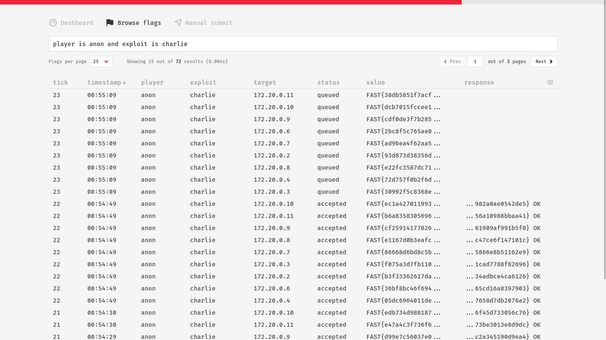

The flag browser offers a way to search for flags using a simple, user-friendly, and flexible **query language**. Being able to efficiently browse flags enchances transparency and allows various useful insights, such as checking how your newly added exploit behaves, identifying affected targets, discovering problems early, and many more.

## Query Language

The query language provides a powerful way to filter and search flags based on various criteria. It is designed to be flexible and intuitive, using symbols and keywords that resemble both natural language and common programming syntax. 

Below you will find a comprehensive list of symbols and keywords, along with examples. These are provided as an aid for using the query language. It's recommended to play around with the flag browser to become familiar with its functionality, and refer to this guide when needed.

!!! note

    All keywords are **case-insensitive**.

### Comparison Operators

```
player is s4ndu
target = "10.1.3.1"
tick >= 30
timestamp after 16:00
tick between 5 and 30
tick between [5, 30]
timestamp between 16:00 and 16:10
```

- Equal to (`==`, `=`, `equals`, `eq`, `is`)
- Not equal to (`!=`, `<>`, `not equals`, `ne`, `is not`)
- Greater than (`>`, `gt`, `over`, `above`, `greater than`)
- Less than (`<`, `lt`, `under`, `below`, `less than`)
- Greater or equal to (`>=`, `ge`, `min`, `not under`, `not below`, `after`)
- Less or equal to (`<=`, `le`, `max`, `not over`, `not above`, `before`)
- Between (`between`)

### String Matching

```
response matches ".* OK"
target contains 10.10.
value starts with "FAST{"
response ending with OK
```

- Matches regex pattern (`matches`, `matching`, `regex`)
- Contains substring (`contains`, `containing`)
- Starts with substring (`starts with`, `starting with`, `begins with`, `beginning with`)
- Ends with substring (`ends with`, `ending with`)

### In and Not In

```
status in [accepted, rejected]
exploit not in [alpha, bravo]
player of [alice, bob]
player not of ['alice', 'bob']
```

- Contained in (`in`, `of`)
- Not contained in (`not in`, `not of`)

### Describing Timestamps

!!! note

    The today's date is assumed when searching by timestamp.

```
16:00, 16.00, 16-00, 16:00:45, 09:20, 9:20
5 mins ago, 1 hour ago, 5 hour ago, 20 seconds ago
```

- Seconds ago (`s`, `sec`, `second`, `seconds`) + `ago`
- Minutes ago (`m`, `min`, `mins`, `minute`, `minutes`) + `ago`
- Hours ago (`h`, `hour`, `hours`) + `ago`

### Logical Operators


You can combine multiple search criteria using logical operators, with a precedence order of "`NOT`, `AND`, `OR`." Parentheses can be used to override this precedence and can be nested, allowing highly customizable queries.

```
player is s4ndu and exploit is alpha
status == accepted && (exploit == alpha || target == 10.1.4.1)
exploit is alpha or (target is 10.1.4.1 and (timestamp < 16:00 or timestamp > 18:00))
```

- Conjunction (`and`, `&`, `&&`, `,`)
- Disjunction (`or`, `|`, `||`)
- Negation (`not`, `~`, `!`)
