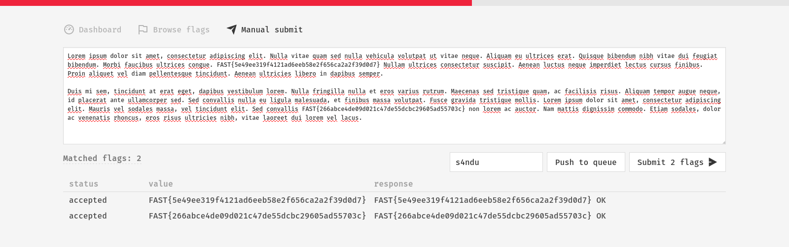

The Manual Submitter serves as a tool for submitting flags manually when you have the flags but not the exploit ready yet. It provides a text area where you can paste any content, such as HTTP response data containing one or multiple flags. After you paste the text, the flags will be matched using regex.

The manual submitter offers two actions for handling matched flags:

- **Queue the flags**: You can push the flags to the submission queue and wait for them to be submitted in the next scheduled submit.
- **Submit immediately**: Alternatively, you can submit right away and get immediate results.

The actual flag submission is handled by your submitter module. You can also manually submit dummy flags to ensure that the submitter module is functioning properly.
