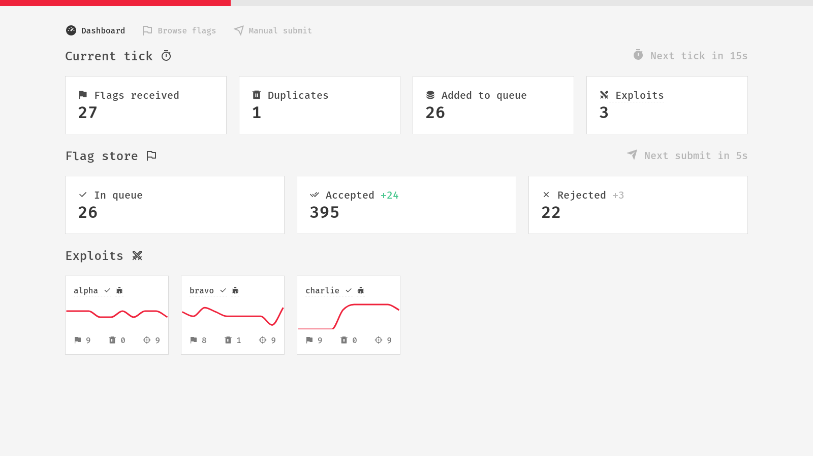

Fast comes with an intuitive web interface for monitoring and evaulating the performance of all running exploits during an A/D competition. You can track your exploits' performance in real-time, browse the flags using a simple yet flexible query language, and submit new flags manually.

To access the dashboard, navigate to `http://<Fast Server Host>:<Fast Server Port>/` in your web browser. If Basic Auth is enabled, the browser will prompt you for the credentials (username can be set to anything).

The interface consists of three views:

- [Dashboard](dashboard.md)
- [Flag Browser](browser.md)
- [Manual Submitter](manual.md)
